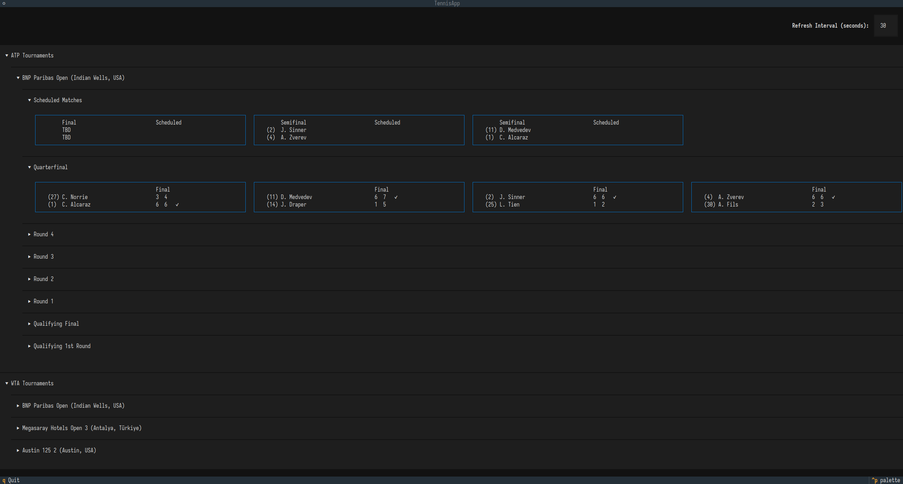

# Get Tennis Scores

Get ATP and WTA tennis live scores quickly in your terminal.

Written in Python, utilizes Textual.

<!-- App Screenshot -->

## Why a Tennis Scores Terminal App?

Sometimes when I'm working in my terminal (or in Emacs, really), I want a quick way to check on ATP and WTA scores, but I don't want to switch to my browser to do it. So why can't I just see it in my terminal?

## Features

* Real-time ATP & WTA match & score tracking
* Responsive grid layout that adapts to terminal resizing
* JSON schema validation via Pydantic
* Adjustable API polling interval

## Limitations

Currently the app only tracks ATP and WTA singles events.

Additionally, the tennis score tracking data provided by ESPN's unofficial API is structurally limited.

* **Score Resolution:** Point-by-point tracking (e.g., 15-0, 30-40, Ad-In) is not supported. The data feed exclusively provides aggregated game and set scores.
* **Tournament Availability:** The API solely tracks tournaments that are currently in progress. It does not provide historical data for past tournaments or schedules for inactive, future events.

## Configuration

The live score tracking refresh interval is adjustable at the top of the UI. The default is set to 30 seconds. A 10 second minimum is enforced to reduce the risk of API rate limiting. 

There is little reason to having a low refresh interval anyway since the score tracks only games and sets, not points.

## To-do

- [ ] Incorporate doubles events
- [ ] Implement a player search feature

## Disclaimer

**Not Affiliated with the Data Provider:** This project is an independent, open-source educational tool. It is not affiliated with, endorsed by, sponsored by, or associated with ESPN, The Walt Disney Company, the ATP Tour, or the WTA Tour. "ESPN" and related trademarks are the property of their respective owners.

**Unofficial API Usage:** This application retrieves data utilizing an undocumented, unofficial API. By executing this software, you acknowledge the following risks:
* **Terms of Service:** Automated extraction of data via this endpoint may violate the data provider's Terms of Service.
* **Assumption of Risk:** You run this software entirely at your own risk. The author assumes no liability for any consequences arising from its use, including but not limited to IP address bans, network rate-limiting, or legal action initiated by the data provider against the end-user.
* **Application Stability:** The upstream API schema, endpoints, and data structures are subject to modification at any time without public notice. Such changes will result in application crashes or data parsing failures until the repository's internal data models are manually updated to reflect the new API contract.

## MIT License

This project is licensed under the MIT License - see the [LICENSE](LICENSE) file for details.
